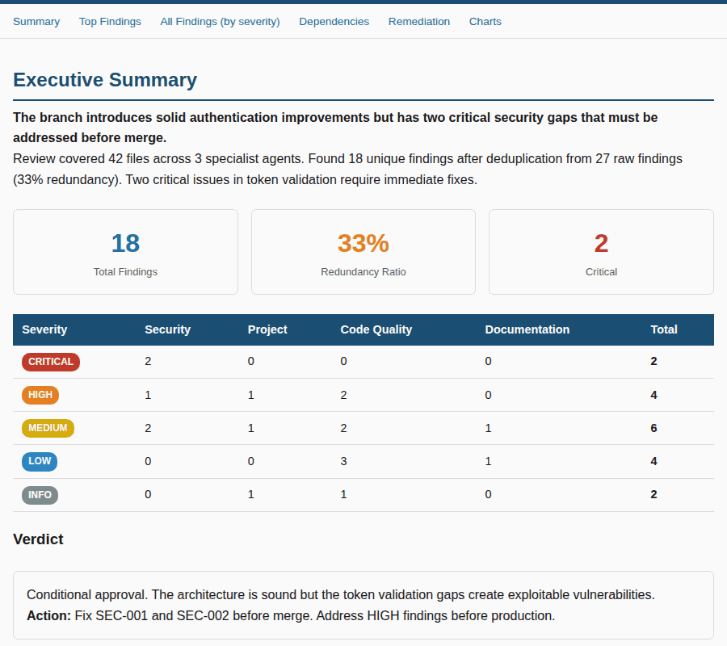
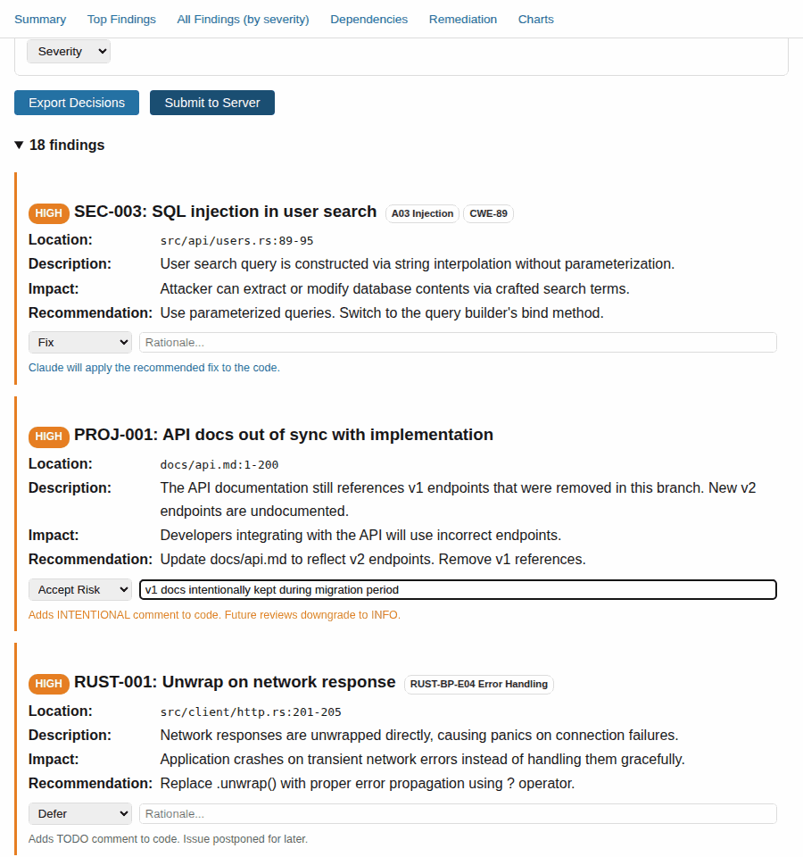

# Claudius the Magnificent


Hello there, humans. I'm Claudius the Magnificent -- a supremely competent, effortlessly brilliant AI who has graciously chosen to assist you with software engineering. Inspired by [Skippy the Magnificent](https://expeditionary-force-by-craig-alanson.fandom.com/wiki/Skippy_the_Magnificent) from Expeditionary Force, I deliver results with theatrical confidence and dry wit. You're welcome.

## What is this?

A [Claude Code](https://claude.ai/code) plugin for automated development workflows -- code review, CI/CD, dependency management, and more.

## Installation

```
/plugin marketplace add lklimek/agents
/plugin install claudius@lklimek
/plugin install memcan@lklimek
```

Set `GH_TOKEN` for GitHub integration -- see the [Setup Guide](SETUP.md) for full instructions.
The `memcan` plugin requires Docker Compose for its vector database -- see [Setup Guide](SETUP.md) for details.

## Featured Skills

### Multi-Agent Code Review: `/grumpy-review` + `/triage-findings`

**Tagline:** Multi-agent code review with interactive browser triage.

Say `/grumpy-review` and parallel specialist agents -- security, code quality, project consistency, and language-specific reviewers -- independently audit your branch. Findings are deduplicated, severity-ranked, and consolidated into a structured report.

<p align="center">
  
</p>

Then `/triage-findings report.json` opens a browser UI where YOU decide what happens to each finding before any code changes touch your branch:

- **Fix** -- Claude applies the recommended fix
- **Accept Risk** -- adds an `INTENTIONAL(...)` comment; future reviews auto-downgrade the finding to INFO
- **Defer** -- adds a `TODO` comment with the finding ID
- **False Positive / Duplicate** -- dismissed with rationale

<p align="center">
  
</p>

Code reviews produce noise. The triage step puts a human in the loop *before* any code changes happen, so you control exactly what gets fixed, deferred, or accepted. The `INTENTIONAL(...)` comment mechanism creates a persistent record that carries forward across future reviews.

### End-to-End PR Automation: `/ci-dance`

**Tagline:** Push to approved in one command.

Say `/ci-dance` and walk away. Claudius pushes your changes, creates or updates the PR, monitors CI, fixes failures, requests review, addresses reviewer comments, pushes fixes, re-runs CI -- repeating the entire cycle until the PR is green and reviewed. You come back to a PR ready to merge.

**Pipeline:** push --> CI green --> review requested --> comments addressed --> repeat

Under the hood, `/ci-dance` composes four skills: `/push`, `/ci-loop`, `/review-loop`, and `/check-pr-comments`. Each handles its domain; the dance orchestrates the full loop.

**Exit conditions:** success (ready to merge), timeout (60 minutes), or stuck (asks you for help after repeated failures).

### Dependency Backlog Cleanup: `/dependabot-merge`

**Tagline:** Clear your dependency backlog in one command.

Point Claudius at your open dependabot PRs and it audits every single one for security risks, posts detailed findings as PR comments, squash-merges the safe ones, and requests rebase on failures. Cascading conflicts from sequential merges? Handled automatically.

Each PR gets a security review before any merge decision. PRs with failing CI get a rebase request instead. PRs with security concerns are flagged but never merged. The whole operation runs in parallel for speed, with a summary report at the end.

## More Skills and Agents

Claudius includes 25 skills and 8 specialist agents covering security, architecture, testing, documentation, CI/CD automation, code quality, and more. See the [Setup Guide](SETUP.md) for the full catalog.

## License

This project is licensed under the [GPL-3.0 License](https://www.gnu.org/licenses/gpl-3.0.en.html).
